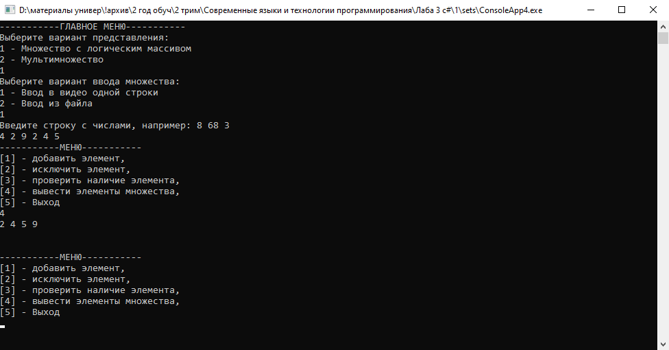

# sets

В проекте создан абстрактный класс Set для работы с множествами натуральных чисел. Он содержит методы для включения, исключения и проверки наличия элемента в множестве, а также для заполнения множества из строки или массива элементов и вывода всех элементов на экран.

Также есть класс SimpleSet, наследующий от Set, который использует логический массив для реализации операций над множествами. В нём есть конструктор с параметром, определяющим максимальное число в множестве, и операторные методы "+" и "*", выполняющие объединение и пересечение множеств.

Для работы с битовыми массивами создан класс BitSet, также наследующий от Set. В нём есть конструктор и аналогичные операторные методы.

Для мультимножеств на основе целочисленного массива создан класс MultiSet, наследующий от Set. В нём есть конструктор с параметром, определяющим максимальное число в множестве.

Также есть собственное исключение, генерируемое при выходе за пределы множества.

Основная программа предоставляет диалог с пользователем, где он выбирает вариант представления множества и может выполнять операции над ними. Также есть возможность чтения множества из файла. Код для разных вариантов представления не дублируется.

Для тестирования операторных методов предусмотрен отдельный тест, где с клавиатуры вводятся два множества, создаются и выводятся объединение и пересечение этих множеств.

